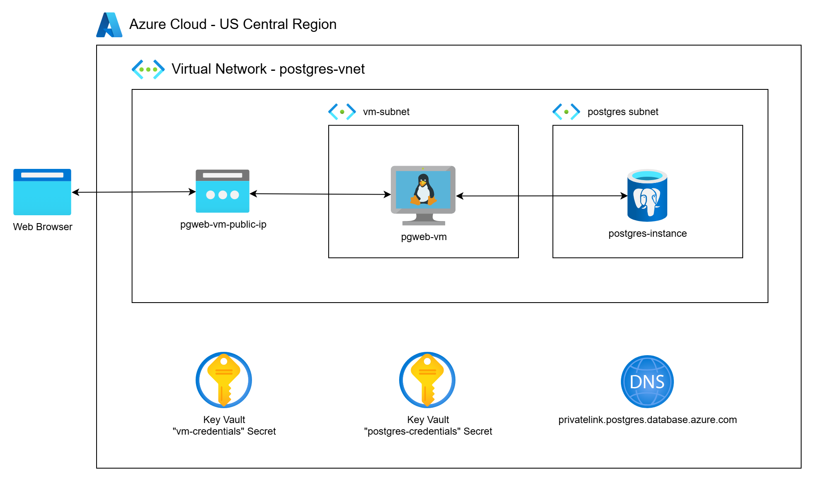
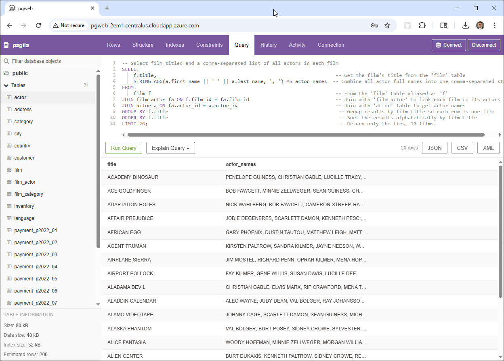

# Deploying PostgreSQL on Azure

This project demonstrates how to deploy a secure, private PostgreSQL Flexible Server on Microsoft Azure using Terraform.

The deployment includes a fully managed Azure PostgreSQL Flexible Server with public access disabled, integrated into a custom virtual network and secured with a Private DNS Zone for internal name resolution. Additionally, the project provisions a lightweight Ubuntu virtual machine that runs [pgweb](https://github.com/sosedoff/pgweb), a browser-based PostgreSQL client, allowing private, browser-accessible interaction with the database.

As part of the configuration, we deploy the [Pagila](https://www.postgresql.org/ftp/projects/pgFoundry/dbsamples/pagila/) sample dataset—a fictional DVD rental database—to showcase real-world querying and administration in a private cloud context. The solution is ideal for developers and teams looking to build secure, internal-facing applications without exposing the database to the public internet.



## What You'll Learn

- How to deploy a fully private PostgreSQL Flexible Server on Azure using Terraform
- How to configure a custom virtual network, subnet, and Private DNS Zone for secure, internal connectivity
- How to provision a VM running `pgweb` for private browser-based database access
- Best practices for securing Azure-managed databases with private endpoints and infrastructure-as-code

## Overview of Azure Database for PostgreSQL – Flexible Server

Azure offers two deployment options for managed PostgreSQL databases: **Flexible Server** and **Single Server**. While Single Server is being phased out, Flexible Server provides enhanced control, performance, and configuration options, making it the recommended choice for new deployments.

This project uses **Flexible Server** with private networking, allowing complete isolation of your database within an Azure Virtual Network. This ensures secure, internal-only access to your PostgreSQL instance—ideal for enterprise workloads, compliance requirements, and production-grade applications.

### Comparison: Flexible Server vs Single Server

| **Aspect**                     | **Flexible Server**                                                                                 | **Single Server (Legacy)**                                                              |
|-------------------------------|------------------------------------------------------------------------------------------------------|-----------------------------------------------------------------------------------------|
| **Networking**                | Supports private endpoints and full VNet integration                                                | Public access with limited VNet support                                                |
| **Availability Zones**        | Supports zone redundancy for high availability                                                      | Limited to single-AZ deployments                                                       |
| **Maintenance Control**       | Fine-grained control over patching and maintenance windows                                          | Limited user control                                                                   |
| **Scaling & Bursting**        | Supports compute burstable SKUs and custom backup retention policies                                | Limited scaling options                                                                |
| **Stop/Start Capabilities**   | Manual stop/start for dev/test cost savings                                                         | Not supported                                                                          |
| **High Availability**         | Built-in HA with same-zone or zone-redundant standby                                                 | Asynchronous geo-redundant replica (manual promotion required)                         |
| **Recommended For**           | Production workloads needing performance, flexibility, and security                                | Legacy workloads; not recommended for new deployments                                  |

### Notes on Azure vs AWS

While AWS Aurora offers a distributed architecture with advanced features like Global Database and Serverless scaling, Azure Flexible Server provides a more traditional PostgreSQL setup focused on **network-level security, deployment control, and cost predictability**. Azure does not currently offer a direct equivalent to Aurora's distributed compute and storage layers, but Flexible Server fills the role of a secure, scalable managed PostgreSQL option within the Azure ecosystem.

## Choosing the Right Azure Option

- **Use Flexible Server** if you need private networking, zone redundancy, and better control over maintenance, scaling, and security.
- [**Avoid Single Server**](https://techcommunity.microsoft.com/blog/adforpostgresql/retiring-azure-database-for-postgresql-single-server-in-2025/3783783) for new projects, as it is being deprecated and lacks key enterprise features. 

## Prerequisites

* [An Azure Account](https://portal.azure.com/)
* [Install AZ CLI](https://learn.microsoft.com/en-us/cli/azure/install-azure-cli) 
* [Install Latest Terraform](https://developer.hashicorp.com/terraform/install)

If this is your first time watching our content, we recommend starting with this video: [Azure + Terraform: Easy Setup](https://youtu.be/j4aRjgH5H8Q). It provides a step-by-step guide to properly configure Terraform, and the AZ CLI.

## Download this Repository

```bash
git clone https://github.com/mamonaco1973/azure-postgres.git
cd azure-postgres
```

## Build the Code

Run [check_env](check_env.sh) then run [apply](apply.sh).

```bash
Destroy complete! Resources: 22 destroyed.
~/azure-postgres$ ./apply.sh
NOTE: Validating that required commands are found in your PATH.
NOTE: az is found in the current PATH.
NOTE: terraform is found in the current PATH.
NOTE: jq is found in the current PATH.
NOTE: All required commands are available.
NOTE: Validating that required environment variables are set.
NOTE: ARM_CLIENT_ID is set.
NOTE: ARM_CLIENT_SECRET is set.
NOTE: ARM_SUBSCRIPTION_ID is set.
NOTE: ARM_TENANT_ID is set.
NOTE: All required environment variables are set.
NOTE: Logging in to Azure using Service Principal...
NOTE: Successfully logged into Azure.
Initializing the backend...
Initializing provider plugins...
- Reusing previous version of hashicorp/azurerm from the dependency lock file
- Reusing previous version of hashicorp/random from the dependency lock file
- Using previously-installed hashicorp/azurerm v4.35.0
- Using previously-installed hashicorp/random v3.7.2

Terraform has been successfully initialized!
```
## Build Results

After applying the Terraform scripts, the following Azure resources will be created:

### Virtual Network & Subnet
- Virtual Network: `project-vnet`
  - Address space: `10.0.0.0/23`
- Subnet for PostgreSQL Flexible Server: `postgres-subnet`
  - Address range: `10.0.0.0/25`
- Network Security Group: `postgres-nsg`
  - Allows inbound PostgreSQL traffic on port 5432 from the pgweb VM

### Private DNS & Networking
- Private DNS Zone: `privatelink.postgres.database.azure.com`
  - Enables internal name resolution for the private PostgreSQL server
- Private Endpoint:
  - Linked to the PostgreSQL Flexible Server
  - Associated with the custom subnet and DNS zone

### Azure Key Vault
- Key Vault: `postgres-kv`
  - Stores credentials securely
  - Access granted via Key Vault policy

### PostgreSQL Flexible Server
- Server Name: Defined in variables
- Configuration:
  - Private access only (public network access disabled)
  - Admin credentials retrieved from Azure Key Vault
  - Preloaded with the [Pagila sample database](https://www.postgresql.org/ftp/projects/pgFoundry/dbsamples/pagila/)

### Virtual Machine (pgweb)
- VM Name: `pgweb-vm`
  - Ubuntu-based VM to host `pgweb` client
  - Deployed in the same virtual network
  - Connected privately to the PostgreSQL server
  - Configured to launch `pgweb` and expose a browser-based PostgreSQL UI

## pgweb Demo

[pgweb](https://github.com/sosedoff/pgweb/blob/main/README.md) is a simple web-based and cross platform PostgreSQL database explorer.



Query 1:
```sql
-- Select the film title and full actor name for each film
SELECT
    f.title AS film_title,                                      -- Get the film's title from the 'film' table
    a.first_name || ' ' || a.last_name AS actor_name            -- Concatenate actor's first and last name as 'actor_name'
FROM
    film f                                                      -- From the 'film' table aliased as 'f'
JOIN film_actor fa ON f.film_id = fa.film_id                    -- Join with 'film_actor' to link films to their actors
JOIN actor a ON fa.actor_id = a.actor_id                        -- Join with 'actor' table to get actor details
ORDER BY f.title, actor_name                                    -- Order the results alphabetically by film title, then actor name
LIMIT 20;                                                       -- Return only the first 20 results
```

Query 2:

```sql
-- Select film titles and a comma-separated list of all actors in each film
SELECT
    f.title,                                                              -- Get the film's title from the 'film' table
    STRING_AGG(a.first_name || ' ' || a.last_name, ', ') AS actor_names  -- Combine all actor full names into one comma-separated string
FROM
    film f                                                                -- From the 'film' table aliased as 'f'
JOIN film_actor fa ON f.film_id = fa.film_id                              -- Join with 'film_actor' to link each film to its actors
JOIN actor a ON fa.actor_id = a.actor_id                                  -- Join with 'actor' table to get actor names
GROUP BY f.title                                                           -- Group results by film title so each row is one film
ORDER BY f.title                                                           -- Sort the results alphabetically by film title
LIMIT 20;                                                                  -- Return only the first 10 films
```

